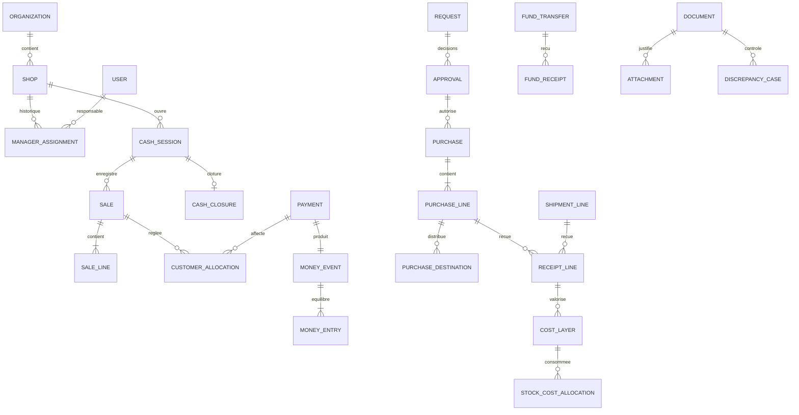

# Relations, cardinalités et compléments du dictionnaire

Le modèle 03-modele-donnees définit les tables de base. Ce complément fixe les relations qui ne doivent pas être déduites librement par l’implémenteur. Les exemples ne sont pas des migrations applicatives ; les contraintes seront ensuite traduites et testées en SQL.

## 1. Vue des agrégats

Diagramme conceptuel : PAYMENT atteint les lignes financières via son money_event. Les événements de variance ou de transfert peuvent exister sans paiement commercial ; côté événement, le lien payment est facultatif. Une receipt_line vient SOIT d’une purchase_line SOIT d’une shipment_line. Une seule affectation gérant active par boutique/utilisateur, malgré cardinalité historique multiple.

## 2. Conventions fermées

- Agrégats : UUID, organization_id, created_at/by, version, updated_at. Tables enfants : UUID, organization_id, FK parent, created_at ; pas de version artificielle indépendante si mutation via parent.
- Tables immutables : pas updated_at ni écrasement ; statut courant des agrégats modifiable uniquement par événements de transition autorisés.
- Tous montants bigint signés seulement si le champ l’exige ; quantités numeric(20,6), pas JSON pour les lignes financières ou allocations stock.
- `users` métier s’appelle `app_users` physiquement et référence la table Better Auth, afin d’éviter conflit des schémas ; mêmes IDs UUID.
- `created_by` peut être NULL uniquement pour bootstrap/migration système, avec `actor_type=SYSTEM` et motif. Les écritures utilisateur exigent actor réel.
- Organization est racine sans organization_id auto-référent ; une seule ligne active. Les contraintes de portée utilisent `(organization_id,id)` unique sur cibles.
- Toutes règles de type XOR (« une origine exactement ») sont CHECK + FK ; validation Zod supplémentaire ne remplace pas la contrainte DB.

## 3. Registre typé des documents

Ajouter `documents(id UUID PK, organization_id, kind, shop_id nullable, created_at, created_by, number UNIQUE/org/kind)`.

`kind` = SALE, PURCHASE, REQUEST, EXPENSE, RETURN, RETURN_RECEIPT, SUPPLIER_RETURN, SHIPMENT, RECEIPT, FUND_TRANSFER, FUND_RECEIPT, CASH_CLOSURE, RECOUNT, STOCK_COUNT, LOSS_REPORT, OPENING_OBLIGATION, CORRECTION, DISCREPANCY, RECOVERY.

Les agrégats cités utilisent `id=documents.id` et `kind` constant contrôlé par FK composite `(organization_id,id,kind)` vers unique du registre. Création registre et détail atomique ; trigger différé garantit détail correspondant à COMMIT. Pas de registre sans détail sauf transaction en cours.

Les écritures financières sont reliées par `payments.money_event_id FK UNIQUE` ; ce champ remplace le terme générique `business_event_id` du tableau 2.0 pour payments. Une commande combinée peut produire un événement stock et un événement fonds portant le même `source_document_id` et `command_id`, sans table universelle d’événements cachée. `command_id` référence la commande d’idempotence durable.

`attachments.document_id`, `discrepancy_cases.source_document_id`, `money_events.source_document_id`, `stock_events.source_document_id`, `notifications.document_id` référencent le registre. Ils remplacent les couples source_type/source_id métier non vérifiables. Audit technique conserve entity_type/id pour ressources non documentaires, sans prétendre à une FK universelle.

Autorisation sur document : rôle + shop/scope métier, pas simple accès au registre. Un achat owner partagé ne donne pas accès à tous ses coûts et autres destinations au gérant ; DTO par destination.

## 4. Achats, destinations et frais

Compléter purchases : `approval_id? FK`, `managing_shop_id? FK`, `supplier_goods_minor`, `supplier_fees_minor`, `supplier_total_minor`, `capitalized_external_fees_minor`, `control_status OPEN/CLOSED`, `payment_status` projeté. Remplacer ambiguïté `total_minor` par supplier_total_minor dans dette et paiement fournisseur.

Ajouter `purchase_destinations(id, organization_id, purchase_line_id FK, destination_location_id FK, allocated_qty>0, cancelled_qty>=0, created_at)` ; unique ligne/destination. Somme allocated_qty <= ordered_qty, contrôle sous verrou ligne. managing_shop obligatoire pour achat gérant, NULL possible achat owner multi-boutiques. Gérant ne reçoit que destination de sa boutique et quantité restante.

Ajouter `purchase_fees(id, organization_id, purchase_id FK, kind SUPPLIER_INVOICE/EXTERNAL_EXPENSE, amount_minor>0, expense_id? FK, allocation_method VALUE/EXPLICIT, description)` ; expense obligatoire si EXTERNAL_EXPENSE, interdit si SUPPLIER_INVOICE. Un expense ne finance qu’un fee (unique partiel), jamais deux capitalisations. Lignes de répartition `purchase_fee_allocations(fee_id,purchase_line_id,amount_minor>=0)` somme exacte fee.

Dette fournisseur = goods + fees facturés par ce fournisseur − règlements − crédits reconnus. Frais externes payés au transporteur ne gonflent pas sa dette. Capitalisation autorisée seulement avant première réception ; frais arrivant plus tard = charge logistique sans rétroactivité. Une dépense capitalisée est exclue des charges d’exploitation dans marge analytique, mais reste un paiement sortant.

Ajouter `purchase_line_adjustments(id,line_id,qty_cancelled,amount_credit_minor,refund_due_minor,reason,approved_by,document_id)` pour reliquat abandonné. Pas modification ordered_qty postée ; restant attendu dérivé. Autorisation consommée historique ne s’efface pas ; crédit commercial et reliquat budgétaire à réaffecter sont décisions distinctes.

## 5. Réceptions et coût

receipt_lines : colonnes `purchase_line_id?`, `shipment_line_id?`, CHECK exactement une non NULL ; variante doit correspondre ; lot même variante ; `accepted_qty`, `damaged_qty`, `surplus_qty` tous >=0 ; somme >0. `received_qty` = leur somme, projection, pas entrée indépendante. Pour le contrôle attendu, accepted+damaged <= restant ; surplus n’est jamais compté comme réception de la ligne commandée.

Une réception d’achat peut comporter plusieurs lignes du même produit pour lots différents. Un lot physique partagé a un code stable par variante ; deux dates d’expiration contradictoires pour même code sont refusées et ouvrent correction owner.

cost_layers inclut `compartment`, `shipment_line_id?`, `parent_layer_id?` et snapshots produit/lot. Tout transfert de compartiment consomme la couche source et crée couche fille, conserve valeur ; ne pas modifier sa localisation d’origine en place. `remaining_*` projections modifiables sous verrou, `initial_*` immutables.

stock_cost_allocations contient FK stock_event, layer, qty_out>=0, value_out>=0 ; une consommation, jamais « signed » ambigu. Entrée nouvelle couche trace son stock_event de création. Corriger le dictionnaire 2.0 : quantités signées sont dans stock_entries, consommations de couches sont positives. Retours créent nouvelles couches liées aux allocations d’origine ; pas d’augmentation rétroactive des couches consommées.

Contraintes de conservation contrôlées dans transaction : somme des consommations <= initial, remaining = initial − consommations ; couches filles total valeur = valeur consommée pour transfert. Surplus UNVALUED ne doit pas participer au coût moyen ni FIFO vendable.

## 6. Remises et remboursements partiels

Ajouter `fund_receipts(id=document_id, organization_id, transfer_id FK, receiver_id FK, amount_minor>0, received_at, money_event_id UNIQUE, session_id? FK, comment?)`. `fund_transfers.amount_received_minor` devient somme projetée des reçus, pas saisie modifiable. Réception totale atomiquement <= envoyé. `money_account_id` sur payment_sources est FK UNIQUE ; supprimer FK inverse source_id sur money_accounts pour éviter cycle.

Ajouter `return_receipts(id=document_id, return_id FK, receiver_id, received_at)` et `return_receipt_lines(id, return_receipt_id, return_line_id, qty_base>0, disposition, stock_event_id)` ; reçu cumulé <= approuvé. returns peut être PARTIALLY_RECEIVED. refund_allocations porte amount >0 et référence payment OUT. Comptes source doivent appartenir à entreprise et être autorisés au payeur.

Ajouter `return_value_allocations(id, return_receipt_line_id, sale_line_id, net_reduction_minor, debt_reduction_minor, writeoff_reversal_minor, refund_due_minor, cost_reversal_minor)` ; somme trois composantes financières = net_reduction. `writeoff_reversal_minor` reprend seulement abandon rattaché à cette vente, pas dette d’un autre client.

## 7. Soldes d’ouverture

Ajouter `opening_obligations(id=document_id, shop_id?, customer_id?, supplier_id?, direction RECEIVABLE/PAYABLE, amount_minor>0, reference, effective_date,due_date?, declared_by, approved_by, reason)` ; exactly one client/fournisseur selon direction, aucune stock/vente/achat fictif. Origin OPENING clairement étiquetée dans soldes et rapports.

Allocations client/fournisseur étendues : `sale_id?` ou `opening_obligation_id?` exclusifs côté client ; purchase_id? ou opening_obligation_id? exclusifs fournisseur. Références simples plutôt qu’un target_id libre. Dettes initiales à solder doivent exister avant activation ; si oubli ultérieur, correction owner explicite, pas modification rétroactive du CA.

## 8. Appareils et séquences

devices.status = PENDING/ACTIVE/REVOKED/REPLACED. Capacité seulement après ouverture. device_events ajoute `execution_mode ONLINE/OFFLINE`, `online_authorization_id?`, `capability_id?` XOR, `declared_execution NOT_EXECUTED/EXECUTED/UNKNOWN`, `replaces_operation_id?`, `resolved_by?`, `resolution_reason?`.

`online_authorizations(id,device_id,session_id,payload_hash,expires_at,consumed_operation_id?)` une consommation max ; renvoi réponse idempotent. `device_sequence_resolutions(id,device_id,seq_from,seq_to,reason,approved_by,recovery_document_id)` traite trous suite perte uniquement. `sync_cursors` doit avoir journal de changements `sync_changes(shop_id,revision,entity_kind,entity_id,operation UPSERT/DELETE,recorded_at)` ; revision strictement croissante par boutique sous verrou. Snapshot complet requis si curseur expiré, jamais delta incomplet silencieux.

Les politiques et prix référencés dans capacités restent conservés tant que événements auditables ; une suppression de version casserait la preuve. `device_events` source est immutable ; états/résultat sont projections auditées.

## 9. Sessions et états manquants

cash_sessions ajoute `purpose TRADING/SETTLEMENT/RECOVERY`, `actor_type`, `recovery_document_id?`. SHOP suspension ajoute `suspension_mode SECURITY/SETTLEMENT`, reason. Session SETTLEMENT ne crée aucune vente, même si source cash disponible.

Stock_counts ajoute `revision`, `previous_revision_id?`, état RECOUNT_REQUESTED ; comptages précédents restent lignes distinctes. Shipment ajoute SUBMITTED et REJECTED, `has_open_discrepancy` projeté séparément. Contrôle achat CLOSED signifie contrôle documentaire, pas dette payée.

## 10. Données modifiables et suppression

| Données | Modification autorisée |
|---|---|
| Nom/contact/adresse | Nouvelle valeur + audit, snapshots anciens inchangés |
| Brouillon | Modification/suppression avant soumission selon auteur |
| Montants/quantités postés | Jamais édition ; compensations |
| Statut courant | Par transition listée uniquement, audit obligatoire |
| Projections de soldes | Par même transaction que journal, pas endpoint de réglage |
| Pièce jointe | Ajout/version, original conservé et rôle restreint |
| Utilisateur/produit utilisé | Désactivation, pas effacement |
| Données client à supprimer | Demande manuelle owner ; anonymisation possible hors obligations de conservation décidées, pas suppression cascade |

Les choix d’anonymisation/conservation légale ne sont pas une règle fiscale inventée : aucun effacement automatique de l’historique financier dans V1.
